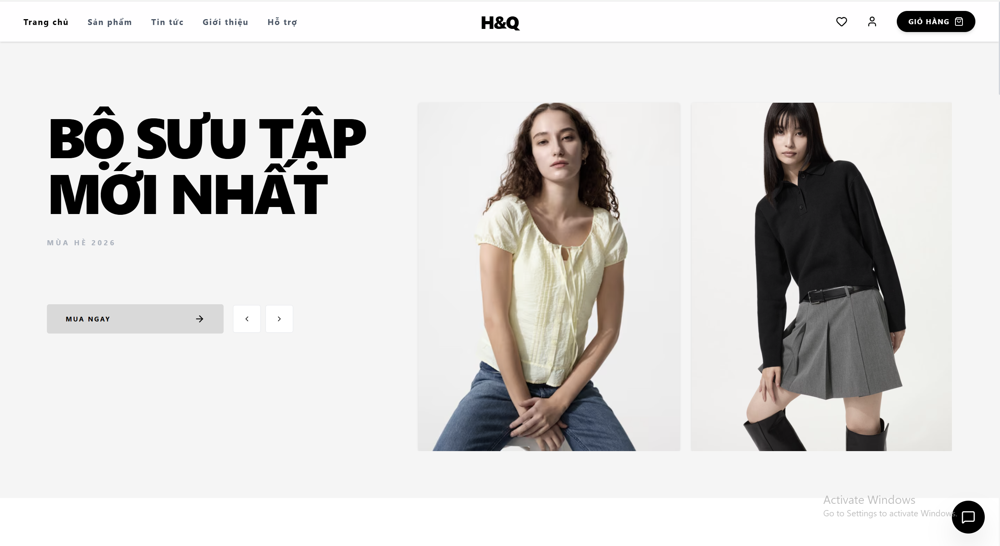
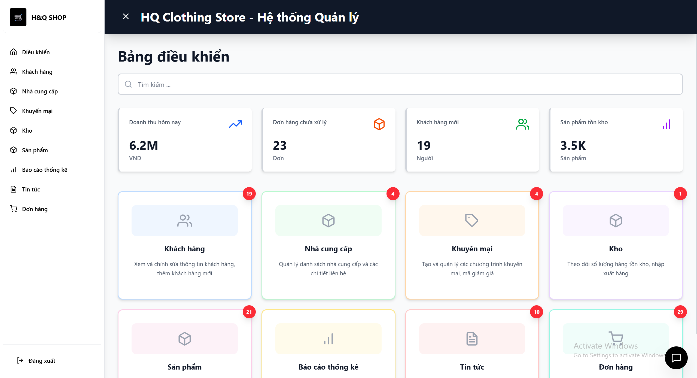
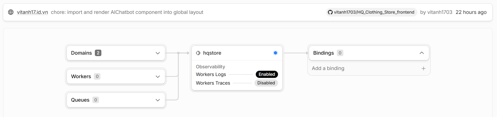
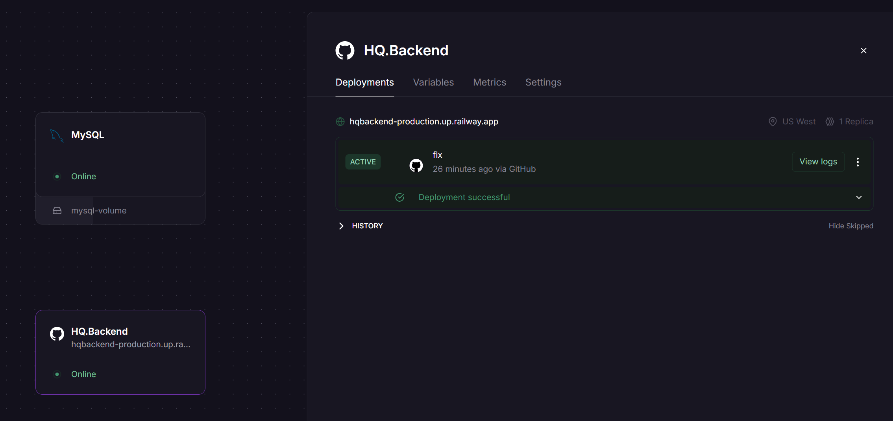

# 👕 H&Q Clothing Store - Website Bán Quần Áo Thời Trang

[](https://dotnet.microsoft.com/)
[](https://reactjs.org/)
[](https://tailwindcss.com/)
[](https://www.mysql.com/)
[](https://pages.cloudflare.com/)
[](https://railway.app/)

**H&Q Clothing Store** là nền tảng thương mại điện tử chuyên biệt cho ngành thời trang. Hệ thống hỗ trợ khách hàng mua sắm trực tuyến dễ dàng và giúp quản trị viên quản lý kho hàng hiệu quả.

**🌍 Link truy cập website:** [https://vitanh17.id.vn](https://vitanh17.id.vn)

**🔐 Tài khoản trải nghiệm (Demo):**
- **Admin:** `admin@hq.com` | Mật khẩu: `123456`
- **Khách hàng:** `diema@gmail.com` | Mật khẩu: `123456`
---

## 📋 Mục lục
1. [Thành viên nhóm](#-thành-viên-nhóm)
2. [Giới thiệu](#-giới-thiệu)
3. [Tính năng](#-tính-năng)
4. [Công nghệ sử dụng](#-công-nghệ-sử-dụng)
5. [Cấu trúc dự án](#-cấu-trúc-dự-án)
6. [Cài đặt và chạy](#-cài-đặt-và-chạy)
7. [API Endpoints](#-api-endpoints)
8. [Video Demo](#-video-demo)
9. [Hình ảnh minh họa hệ thống](#-hình-ảnh-minh-họa-hệ-thống)

---

## 👥 Thành viên nhóm - Cửa hàng H&Q

| STT | Họ và Tên | MSSV | Nội dung thực hiện |
| :--- | :--- | :--- | :--- |
| 1 | **Diêm Việt Anh** | 23810310083 | Thanh toán VNPAY, Luồng đơn hàng, module Giỏ hàng, ChatBot AI và Deploy website |
| 2 | **Nguyễn Thị Hảo** | 23810310152 | Quản trị hệ thống (Admin), Xác thực qua mail, Module Chương trình Khuyến mãi |
| 3 | **Đặng Thị Quỳnh** | 23810310156 | Module Tin tức, Dịch vụ Tiện ích và Sản phẩm, Đăng nhập bằng Google |

---

## 🌟 Giới thiệu
Dự án **H&Q** tập trung vào trải nghiệm mua sắm hiện đại, tối ưu trên cả thiết bị di động và máy tính. Website cho phép người dùng duyệt sản phẩm theo danh mục, xem chi tiết kích thước/màu sắc và thực hiện quy trình thanh toán an toàn.

---

## 🎥 Video Demo

[!Video Demo](https://drive.google.com/drive/folders/1OfRFlPW7xALTE6DBWu4d7hyPqBMV_r1U?usp=sharing)

---

## 📸 Hình ảnh minh họa hệ thống
*(Hãy chụp ảnh màn hình website của bạn, lưu vào thư mục `img/` và cập nhật lại tên file dưới đây)*

**1. Giao diện Trang chủ (Home Page)**


**2. Giao diện Quản trị (Admin Dashboard)**


---

## ✨ Tính năng

### 👤 Khách hàng
| Tính năng | Mô tả |
| :--- | :--- |
| **Xác thực** | Đăng nhập/Đăng ký tài khoản nội bộ và tích hợp đăng nhập bằng Google. |
| **🛍️ Duyệt sản phẩm** | Xem chi tiết sản phẩm, biến thể (kích thước, màu sắc) theo danh mục. |
| **🔍 Bộ lọc & Tìm kiếm** | Lọc sản phẩm linh hoạt theo giá, danh mục, kích thước và màu sắc. |
| **🛒 Giỏ hàng & Wishlist**| Thêm/bớt sản phẩm giỏ hàng và lưu trữ danh sách sản phẩm yêu thích. |
| **💳 Mua hàng & Thanh toán**| Áp dụng mã giảm giá, thanh toán an toàn qua mã QR Ngân hàng (VietQR) / VNPAY Sandbox. |
| **📱 Tài khoản cá nhân** | Quản lý hồ sơ, xem và theo dõi trạng thái chi tiết lịch sử đơn hàng. |
| **💬 Đánh giá sản phẩm** | Chấm điểm (1-5 sao) và để lại bình luận cho các sản phẩm. |
| **📰 Tin tức & Tiện ích** | Đọc tin tức thời trang, chính sách (Privacy/Refund) và trang Hỏi đáp (FAQs). |
| **🤖 Chatbot AI** | Tích hợp AI Gemini 2.5 tư vấn chọn size, phối đồ và giải đáp thắc mắc 24/7. |

### ⚙️ Quản trị (Admin)
| Tính năng | Mô tả |
| :--- | :--- |
| **📈 Báo cáo & Thống kê** | Xem thống kê doanh thu, đơn hàng trực quan theo thời gian. |
| **📦 Quản lý sản phẩm** | Quản lý sản phẩm, danh mục và các biến thể (size, màu sắc, giá bán). |
| **📋 Quản lý đơn hàng** | Xét duyệt và cập nhật trạng thái đơn hàng (Chờ xử lý, Đang giao, Thành công, Đã hủy). |
| **👥 Quản lý người dùng** | Quản lý danh sách tài khoản phân quyền (Admin, Staff, Customer). |
| **🏷️ Quản lý khuyến mãi** | Tạo voucher giảm giá (theo % hoặc số tiền), thiết lập hạn mức sử dụng. |
| **📚 Quản lý kho hàng** | Quản lý số lượng tồn kho theo từng biến thể (SKU) của sản phẩm. |
| **📰 Quản lý nội dung (CMS)**| Đăng tải bài viết Tin tức (News), quản lý bộ Câu hỏi thường gặp (FAQs). |
| **🏭 Quản lý nhà cung cấp**| Thêm, sửa, xóa và quản lý thông tin các nhà cung cấp/xưởng may. |

---

## 🛠 Công nghệ sử dụng

### Frontend
- **React 18** & **TypeScript**
- **Tailwind CSS** (Giao diện chuẩn Responsive)
- **Lucide React** (Icons hệ thống)

### Backend
- **ASP.NET Core 9.0 Web API**
- **Entity Framework Core** (Pomelo.EntityFrameworkCore.MySql)
- **MySQL 8.0**

### Tích hợp & Khác
- **Thanh toán**: VNPAY Sandbox (API thanh toán uy tín)
- **Email**: Brevo API
- **Bảo mật**: bcrypt (password_hash/password_verify)
- **Xác thực**: Đăng nhập bằng Google (Google OAuth 2.0)
- **Chatbot AI**: Gemini 2.5 (Đã được trainning)

### Triển khai
- **Frontend**: [](https://pages.cloudflare.com/) Triển khai giúp tối ưu hóa tốc độ tải trang và bảo mật.


- **Backend & Database**: [](https://railway.app/) Triển khai đảm bảo hiệu năng ổn định, hoạt động liên tục và dễ dàng quản lý.


---

## 📁 Cấu trúc dự án

```bash
HQ_Clothing_Store/
├── 📂 database/                # Chứa file script SQL (hq_clothing_db.sql) để khởi tạo DB
├── 📂 docs/                    # Chứa tài liệu đặc tả yêu cầu phần mềm (SRS)
│   └── 📂 srs/
├── 📂 frontend/                # Ứng dụng Frontend (ReactJS + Vite)
│   ├── 📂 src/
│   │   ├── 📂 components/      # Các thành phần giao diện tái sử dụng
│   │   ├── 📂 pages/           # Các trang chính (Home, FAQPage, PrivacyPolicy...)
│   │   └── 📂 services/        # Cấu hình gọi API tới Backend
├── 📂 HQ.Backend/              # Ứng dụng Backend (ASP.NET Core 9.0)
│   ├── 📂 Controllers/         # Định tuyến và xử lý logic các API Endpoints
│   ├── 📂 Models/              # Các Entity tương tác với Entity Framework Core
│   ├── 📂 DTOs/                # Data Transfer Objects cho việc giao tiếp dữ liệu
│   └── 📂 Data/                # DbContext và cấu hình CSDL
├── 📂 img/                     # Chứa các hình ảnh hiển thị cho tài liệu README
└── README.md                   # Tài liệu giới thiệu và hướng dẫn dự án

```
## 🚀 Cài đặt và chạy

Để khởi chạy dự án, hãy đảm bảo bạn đã cài đặt: **.NET 9 SDK**, **Node.js (v18+)** và **MySQL Server**.

### 1\. Clone dự án

```bash
git clone https://github.com/vitanh1703/HQ_Clothing_Store.git
cd hq-clothing-store
```

### 2. Cấu hình Cơ sở dữ liệu

1. **Tạo database trong MySQL**:
   Mở **MySQL Workbench** hoặc **Terminal** và chạy câu lệnh:
   ```sql
   CREATE DATABASE hq_clothing_db;
   ```

2. **Cập nhật chuỗi kết nối**:
   Mở file `backend/appsettings.json` và thay đổi thông tin `User` và `Password` theo cấu hình MySQL của bạn:
   ```json
   "ConnectionStrings": {
     "DefaultConnection": "Server=localhost;Port=3306;Database=hq_clothing_db;User=YOUR_USER;Password=YOUR_PASSWORD;"
   }
   ```

3. **Khởi tạo dữ liệu từ file SQL**:
   * Mở công cụ quản lý MySQL (như MySQL Workbench, Navicat hoặc phpMyAdmin).
   * Chọn database `hq_clothing_db` vừa tạo.
   * Sử dụng tính năng **Import** hoặc **Open SQL Script** để mở file database của dự án (ví dụ: `database.sql` hoặc file `.sql` tương ứng).
   * Nhấn **Execute** (hình tia sét) để tạo toàn bộ bảng và dữ liệu mẫu.

### 3\. Chạy Backend (API)

```bash
# Tại thư mục backend
dotnet run --urls "https://localhost:7137;http://localhost:5257"
```

### 4\. Chạy Frontend (UI)

Mở một terminal mới:

```bash
cd frontend
npm install
npm install recharts
npm run dev
```

*Truy cập website tại: `http://localhost:5173`*
---

## 📡 API Endpoints chính

### 🔐 Xác thực & Người dùng (Auth & Users)
| Method | Endpoint | Mô tả |
| :--- | :--- | :--- |
| **POST** | `/api/auth/login` | Đăng nhập tài khoản |
| **POST** | `/api/auth/register` | Đăng ký tài khoản mới |
| **POST** | `/api/auth/google-login` | Đăng nhập bằng Google OAuth |

### 🛍️ Sản phẩm & Danh mục (Products & Categories)
| Method | Endpoint | Mô tả |
| :--- | :--- | :--- |
| **GET** | `/api/products` | Lấy danh sách sản phẩm (có lọc, phân trang) |
| **GET** | `/api/products/{id}` | Lấy chi tiết sản phẩm và các biến thể |
| **GET** | `/api/categories` | Lấy danh sách danh mục thời trang |

### 🛒 Giỏ hàng & Đơn hàng (Cart & Orders)
| Method | Endpoint | Mô tả |
| :--- | :--- | :--- |
| **GET** | `/api/cart/{userId}` | Lấy thông tin giỏ hàng của khách hàng |
| **POST** | `/api/cart/add` | Thêm sản phẩm (Size, Color) vào giỏ hàng |
| **POST** | `/api/orders` | Khởi tạo đơn hàng mới |
| **GET** | `/api/orders/user/{userId}`| Xem lịch sử mua hàng của người dùng |

### 🎁 Tiện ích & Khác (Utilities)
| Method | Endpoint | Mô tả |
| :--- | :--- | :--- |
| **GET/POST** | `/api/promotions` | Lấy danh sách và quản lý mã giảm giá |
| **POST** | `/api/payments/vnpay` | Tạo URL thanh toán qua cổng VNPAY |
| **POST** | `/api/chatbot/ask` | Gửi câu hỏi tư vấn cho Chatbot AI Gemini |

---

---
## 📚 Software Requirement Specifications (SRS)

Dưới đây là danh sách các tài liệu phân tích và đặc tả hệ thống đã được cập nhật chuẩn xác theo từng thành viên phụ trách và tính năng thực tế của dự án:

| Chức năng | Người phụ trách | Link tài liệu |
| :--- | :--- | :--- |
| 🔐 **Đăng ký & Xác thực Mail** | Nguyễn Thị Hảo | [Xem](docs/srs/SRS_REGISTER.MD) |
| 🔐 **Đăng nhập & Google OAuth** | Đặng Thị Quỳnh | [Xem](docs/srs/SRS_LOGIN.MD) |
| 👤 **Quản lý hồ sơ cá nhân** | Nguyễn Thị Hảo | [Xem](docs/srs/SRS_PROFILE_MANAGEMENT.MD) |
| 📦 **Quản lý sản phẩm** | Đặng Thị Quỳnh | [Xem](docs/srs/SRS_PRODUCT.MD) |
| 🛍️ **Danh mục & Dịch vụ** | Đặng Thị Quỳnh | [Xem](docs/srs/SRS_PRODUCT_CATALOG.MD) |
| 🔍 **Chi tiết sản phẩm** | Đặng Thị Quỳnh | [Xem](docs/srs/SRS_PRODUCT_DETAIL.MD) |
| ⭐ **Đánh giá sản phẩm** | Đặng Thị Quỳnh | [Xem](docs/srs/SRS_PRODUCT_REVIEW.MD) |
| 🛒 **Giỏ hàng (Cart)** | Diêm Việt Anh | [Xem](docs/srs/SRS_SHOPPING_CART.MD) |
| 📋 **Luồng đơn hàng & Checkout** | Diêm Việt Anh | [Xem](docs/srs/SRS_CART_CHECKOUT.MD) |
| 💳 **Thanh toán VNPAY / VietQR**| Diêm Việt Anh | [Xem](docs/srs/SRS_CHECKOUT_PAYMENT.MD) |
| 🤖 **Tích hợp Chatbot AI** | Diêm Việt Anh | [Xem](docs/srs/SRS_CHATBOT.MD) |
| ❤️ **Danh sách yêu thích** | Đặng Thị Quỳnh | [Xem](docs/srs/SRS_WISH_LIST.MD) |
| 🏷️ **Quản lý mã khuyến mãi** | Nguyễn Thị Hảo | [Xem](docs/srs/SRS_PROMOTION_CODE.MD) |
| ⚙️ **Xử lý đơn hàng (Admin)** | Nguyễn Thị Hảo | [Xem](docs/srs/SRS_ORDER_PROCESSING.MD) |
| 📚 **Quản lý kho hàng** | Nguyễn Thị Hảo | [Xem](docs/srs/SRS_INVENTORY_MANAGEMENT.MD) |
| 📈 **Báo cáo doanh thu** | Nguyễn Thị Hảo | [Xem](docs/srs/SRS_REVENUE_REPORT.MD) |
| 📰 **Module Tin tức & FAQs** | Đặng Thị Quỳnh | [Xem](docs/srs/SRS_NEWS_FAQS.MD) |
